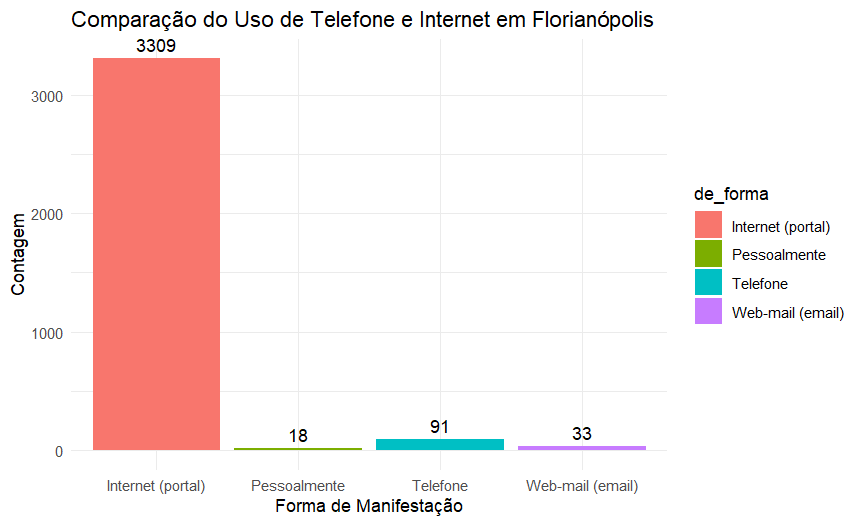

# Análise do Uso de Telefone e Internet em Florianópolis

## Objetivo

O objetivo deste projeto é criar um gráfico que compare o uso de telefone e internet na cidade de Florianópolis, utilizando dados da planilha "manifestacoes-de-ouvidoria.xlsx". A análise foca na coluna "de_forma", que contém as formas de manifestação dos usuários.

## Requisitos

Antes de executar o código, você deve garantir que o pacote `ggplot2` esteja instalado. Se ainda não estiver, você pode instalá-lo usando o seguinte comando no R:

```r #Instalar o pacote ggplot2, caso ainda não esteja instalado
if (!require(ggplot2)) install.packages("ggplot2")
```

## Como executar o código
1. Instale os pacotes necessários:
    - ggplot2
    - readxl
    - Carregue os pacotes:
2. Rode o código 

## Gráfico Gerado



## Conclusão
Este projeto apresenta uma análise visual do uso de telefone e internet em Florianópolis, permitindo uma compreensão mais clara das preferências dos cidadãos em relação às formas de manifestação.

 